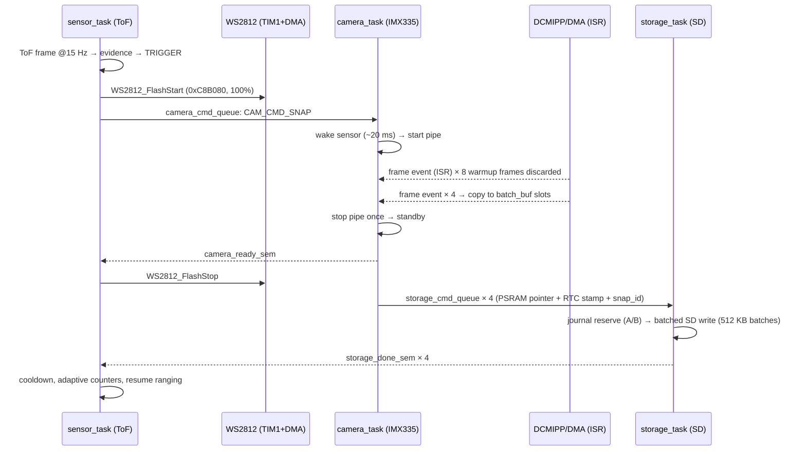

# System Architecture — Overview

Standalone firmware for an autonomous insect trap. One MCU runs the complete
system: a ToF sensor watches the trap floor, and when an insect is detected the
firmware lights the trap, captures a short camera burst and stores the frames
on an SD card. No PC connection is required after flashing.

All statements in this document are verified against the current source tree.
Companion documents:

* `07_THREAD_ARCHITECTURE.md` — every FreeRTOS task, IPC object, sync rule
* `08_ALGORITHMS.md` — ToF detector, baseline adaptation, camera, light, storage
* `09_TUNING_PARAMETERS.md` — every tunable parameter in `Inc/app_config.h`

## 1. Hardware

| Block | Part | Interface | Role |
| :--- | :--- | :--- | :--- |
| MCU | STM32N6570 (Cortex-M55) on NUCLEO-N657X0-Q | — | Runs everything (FreeRTOS, 1 kHz tick) |
| Camera | CMW-IMX335, 5 MP | CSI-2 → DCMIPP ISP | YUV422 frames, output 1296×972 (production) |
| ToF primary | VL53L5CX @ I2C address 0x29 | I2C1 | 4×4 ranging grid @ 15 Hz (production) |
| ToF guardian | VL53L5CX @ 0x31 (0x62 8-bit write) | I2C1 | Dual-sensor mode only — **disabled** in current build |
| Light | 12 × WS2812 RGB LEDs | TIM1 PWM + GPDMA1 | Illumination during capture |
| SD card | SD/SDHC/SDXC | SDMMC2, 4-bit bus, 512-byte blocks | Raw image storage + A/B append journal |
| PSRAM | 16 MB (XSPI) | memory-mapped | Frame buffers + SD write staging |
| NOR flash | onboard (XSPI OPI, DTR) | memory-mapped | Initialized at boot |
| RTC | DS3231 | I2C | Battery-backed UTC timestamps |
| User I/O | USER button (PC13), RED/GREEN LEDs | GPIO | Manual mode, status |
| Console | UART, `printf` | — | Boot banner, `[CAM]`, `[SD]`, `[ToF]`, `[ADAPT]`, `[LIGHT]` logs |

Two peripherals share **I2C1**: the camera middleware and the ToF driver use
independent HAL handles on the same physical bus. A recursive FreeRTOS mutex
(`i2c_arbiter.c`, created before any task starts) serializes them. In addition,
the camera is fully initialized **inside the main init thread before the worker
tasks start** (mode 4), which removes the boot-time race that otherwise makes
`CMW_CAMERA_Init` fail with `ret=-7`.

## 2. PSRAM memory map (production configuration)

One production frame is 1296×972 YUV422 = **2,531,328 bytes (≈2.5 MB)**.

| Buffer (main.c) | Size | Purpose |
| :--- | :--- | :--- |
| `capture_buf` | 2.5 MB | DCMIPP ping-pong slot A (mode 4) |
| `save_buf` | 2.5 MB | DCMIPP ping-pong slot B (mode 4) |
| `batch_buf` | 4 × 2.5 MB = 10 MB | Final slots for the 4 burst frames |
| `sd_batch_buf` | 1024 × 512 B = 512 KB | SD multi-block write staging |

Total ≈ 15.5 MB of the 16 MB PSRAM. (The `main.c` comment above `sd_batch_buf`
still says "64×512 = 32 KB"; the allocate size follows the define and is 512 KB.)

## 3. Capture modes (`CAPTURE_MODE`)

| Mode | Name | Trigger | Behavior | Status |
| :--- | :--- | :--- | :--- | :--- |
| 0 | ON-DEMAND | USER button | Full camera init → warmup → 1 full-res frame → deinit. ToF off, no `sensor_task` | Legacy/validation only |
| 1 | CONTINUOUS | ToF | Pipe always running; on trigger one frame is copied from the double buffer | Superseded |
| 2 | BATCH | ToF | Pipe restart between frames → tearing; known I2C conflict | Not used |
| 4 | CALLBACK-BATCH | ToF | Camera initialized once at boot, parked in standby; on trigger the pipe runs **continuously** through warmup + burst, frame-ready events come from the DCMIPP ISR callback, pipe stopped once at the end | **Production** |

Current build: `CAPTURE_MODE 4`, `TEST_TOF_MODE 0`, `VL53L5CX_DUAL_SENSOR 0`.

## 4. Boot sequence (verified order, `main_thread_fct`)

Tasks are created in `main()` → `main_freertos()` **before** `vTaskStartScheduler()`;
each worker then waits for the `system_ready` flag. The main thread (lowest
priority) performs initialization in this order and deletes itself:

1. `SystemClock_Config()` + FreeRTOS port timer
2. UART console; build banner `[BUILD] KAN-36 drift-reset-v2 <date> <time>`
3. `Fuse_Programming()`
4. Light system: `MX_GPDMA1_Init()`, `MX_TIM1_Init()`, `WS2812_Init()` (LEDs off)
5. PSRAM (`BSP_XSPI_RAM_Init/Enable`) and NOR (`BSP_XSPI_NOR_Init/Enable`, OPI/DTR)
6. LEDs + USER button (PC13, active high)
7. `Security_Config()`, `IAC_Config()`, low-power clock gates
8. SD card init (through the journal shim: up to 3 attempts with SDMMC2
   peripheral reset, validated `ClockDiv=4`, 4-bit bus) + write/read benchmark
   on blocks below 3072 with byte-compare verification
9. `I2C_Arbiter_Init()` + `IPC_Init()` (queues and semaphores — see doc 07)
10. Camera pre-init: mode 4 calls `CAM_CallbackInit()` → full init + warmup,
    sensor left in **standby**. Skipped entirely in `TEST_TOF_MODE`.
11. ToF: `VL53L5CX_I2C_Init()`, `VL53L5CX_PowerUp()`; RTC: `RTC_Init()`
12. `system_ready = 1` → `sensor_task` runs `VL53L5CX_Init → Configure →
    StartRanging → LearnBaseline` (~2.5 s) and starts detecting.

## 5. End-to-end flow — one detection event (production)

| Phase | Duration (current config) |
| :--- | :--- |
| ToF ranging period | 67 ms (15 Hz) |
| Camera wake | ~20 ms |
| Warmup (8 × 33 ms) | ~264 ms |
| Burst (4 × 33 ms, pipe continuous) | ~132 ms |
| SD write of 4 × 2.5 MB (card dependent) | ~7–8 s (earlier measured log: ~5.7 s for 3 frames) |
| Cooldown after event | ≈0.35 s (5 ToF frames) |
| Periodic baseline re-learn | every ~66 s (1000 frames), a few seconds of ToF blind time |

## 6. Intelligence layer — what "AI" is in this system

There is **no on-device machine-learning model** in the firmware. The
STM32N6 Neural-ART accelerator is not used. Detection intelligence is an
adaptive rules/statistics engine (`vl53l5cx_detection.c`), described in doc 08:

* per-zone learned baselines with common-mode (vibration) removal,
* several evidence classes (strong distance, fast edge, floor sustain,
  floor score, micro-persistence) tuned for tiny insects on the trap floor,
* four self-calibration mechanisms (periodic re-learn, per-zone recentering,
  drift refresh, camera-activation refresh) that keep the baseline honest
  against slow environmental drift.

Host-side Python tools are **offline** analysis only: `datalogger.py`
(ALLPARAM frames), `zone_monitor.py` (ZFRAME frames), `analysis.py`, and the
raw-YUV SD viewer.

## 7. Key source files

| File | Role |
| :--- | :--- |
| `Src/main.c` | Boot, task creation, PSRAM buffers, SD init/bench, mode-0 manual path, ToF power |
| `Src/app_thread.c` | `sensor_task`, `camera_task`, `storage_task`, IPC, capture orchestration, batched SD write |
| `Src/vl53l5cx_detection.c/.h` | ToF driver wrapper + complete detection algorithm + adaptive baselines |
| `Src/app_cam.c/.h` | CMW-IMX335 + DCMIPP pipeline (all capture modes, frame-event callback) |
| `Src/ws2812.c/.h` | Light driver (reliable strobe, off-watchdog) |
| `Src/sd_storage_journal.c` | Persistent A/B append journal (blocks 3070/3071) |
| `Src/i2c_arbiter.c` | Shared-I2C1 recursive mutex |
| `Src/ds3231.c`, `Src/ds3231_calendar.c` | RTC driver |
| `Src/perf_debug.c` | Phase timing / statistics (gated by `PERF_DEBUG_LEVEL`) |
| `Inc/app_config.h` | **Single source of truth for all tunable parameters** (doc 09) |

