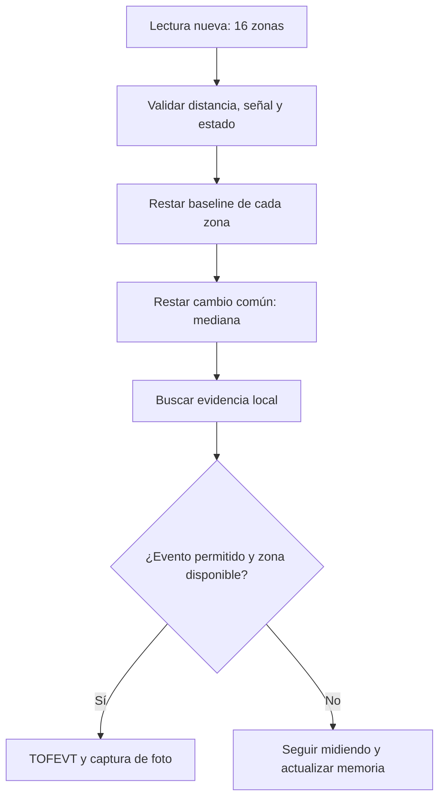
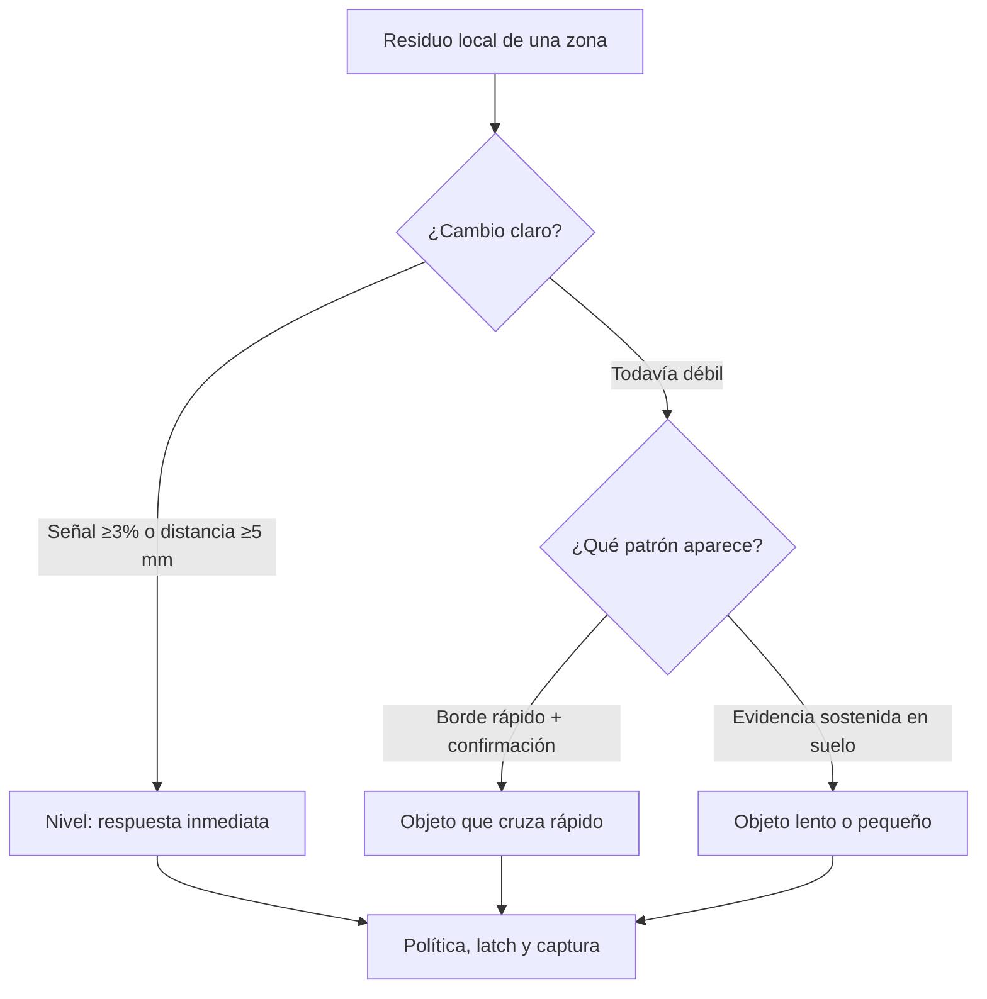
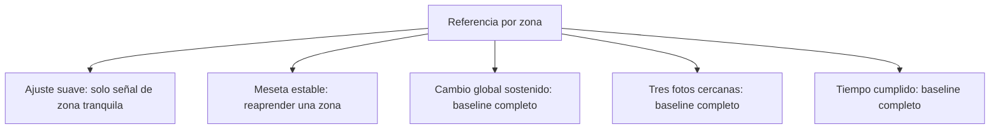

# Algoritmo ToF 4×4: de la medición a la foto

Esta explicación corresponde al modo que estás usando: un sensor, cámara
activa, 4×4 zonas, `VL53L5CX_DET_HIGH_SENS_CAMERA=1`, integración de 45 ms
y frecuencia solicitada de 15 Hz. Explica el firmware de
`KAN-36-configurable-tof-baselines.patch` sin proponer nuevos valores.
El catálogo detallado de parámetros y la metodología de ensayos siguen en
`docs/TOF_DETECTION_FIELD_GUIDE.md`.

## 1. Imagen mental del sistema

El sensor no entrega una imagen de 16 píxeles: entrega mediciones de **distancia
y señal** en 16 regiones. Durante el baseline registra qué distancia y señal
ve normalmente cada región de la caja. Después pregunta: «¿ha cambiado esta
región respecto a su referencia y respecto al cambio común del resto?».



### Por qué se resta la mediana

Si una vibración desplaza casi toda la escena, muchas zonas cambian en la
misma dirección. La **mediana** estima ese cambio común; restarlo deja
pequeños residuos. Un insecto que modifica solo una zona puede dejar un
residuo mayor allí. Esto reduce ciertas vibraciones, pero no garantiza
separarlas de un insecto que genera una señal comparable al ruido.

Ejemplo simplificado de distancia, en milímetros:

| Medida | Zona de fondo | Zona con objeto |
| --- | ---: | ---: |
| Cambio respecto al baseline | −2 | −7 |
| Mediana de las zonas válidas | −2 | −2 |
| Residuo local | 0 | −5 |

Un residuo negativo de distancia significa que el objeto quedó **más cerca
del sensor** que el fondo esperado. `TOFCAL` muestra este signo; los valores
`ld_mm` de `TOFEVT` muestran la magnitud del residuo.

## 2. ¿Qué evidencia puede generar una foto?



| Camino | Idea | Parámetros principales |
| --- | --- | --- |
| Nivel fuerte | Un cambio local evidente puede solicitar una foto inmediatamente. | `VL53L5CX_DET_THRESHOLD_PCT` = 3%; `VL53L5CX_DET_LOCAL_DIST_STRONG_MM` = 5 mm. |
| Borde rápido | Un salto entre lecturas necesita respaldo respecto al baseline y confirmación posterior. | `...FAST_EDGE_SIGNAL_PCT` = 2%; `...FAST_EDGE_DISTANCE_MM` = 4 mm; límites `...FAST_BASELINE_*`. |
| Suelo débil | Señal débil repetida o pequeño saliente hacia el sensor acumulan evidencia. | `...LOCAL_SIGNAL_WEAK_PCT` = 2%; `...FLOOR_HOLD_FRAMES` = 4; puntuación `...FLOOR_SIGNAL_SCORE_*`. |
| Micro persistencia | Evidencia aún menor en **la misma zona** suma puntos y se reduce cuando desaparece. | `...MICRO_SIGNAL_PCT` = 1%; `...MICRO_DISTANCE_MM` = 2 mm; `...MICRO_HIT/DECAY/TRIGGER` = 2/1/32. |

El seguimiento débil entre distintas zonas está configurado en **0**
(`VL53L5CX_DET_WEAK_TRACK_ENABLED=0`), porque produjo activaciones falsas.
El indicador de movimiento interno del sensor puede intervenir en la lógica
de estabilidad, pero **no es por sí mismo un disparador de foto** en este
modo. Una zona con baja calidad o señal inferior a
`VL53L5CX_DET_MIN_SIGNAL` (500) queda fuera de la detección local.

## 3. ¿Por qué no toma miles de fotos del mismo objeto?

Cuando una zona produce un evento, queda marcada por un **latch**: mientras
persista esa misma evidencia, normalmente no vuelve a fotografiarse. Un
evento inicialmente débil puede obtener **una** segunda foto si más tarde
aparece evidencia fuerte independiente y confirmada. Al desaparecer el
indicio durante tres lecturas, el latch se libera.

Después de la captura, se limpian recuerdos de bordes viejos, pero se
conservan los latches. El `cooldown` normal es de **5 nuevas lecturas**:
durante ellas el detector todavía observa la escena para mantener sus
latches, pero no inicia otra foto. Un breve periodo adicional tras ciertos
baselines restringe los caminos débiles. Estos mecanismos se complementan;
no son el temporizador del baseline periódico.

## 4. Cinco maneras distintas de ajustar la referencia



| Mecanismo | Cuándo actúa hoy | Alcance | ¿Reinicia el reloj periódico? |
| --- | --- | --- | --- |
| Ajuste suave de deriva | Tras 15 lecturas tranquilas de una zona, si cumple las condiciones | Señal de esa zona, mediante un paso de aproximadamente diferencia/32 | No |
| Meseta estable | Evidencia casi inmóvil durante al menos 12 s y suficientes lecturas estables | La zona afectada; puede aprender un insecto que permanezca inmóvil | No |
| Cambio global | Al menos 12 zonas cambian de forma coherente durante 5 s, con las condiciones del detector | Solicita baseline completo | Sí, al finalizar |
| Tres capturas | Tercera activación dentro de la ventana móvil de 30 s | Baseline completo | Sí, al finalizar |
| Periódico | ~66,67 s después del **último baseline completo** | Baseline completo, incluso con zonas latcheadas | Sí, al finalizar |

El botón manual y el aprendizaje inicial también crean un baseline completo.
Un baseline completo detiene y reinicia las mediciones, descarta 15 lecturas
de estabilización y promedia 20 lecturas de aprendizaje. Durante ese proceso
no se detecta un insecto. La lectura utilizada para aprender no se envía
después al detector como si fuera una lectura nueva.

**Caso de vibración:** si el baseline completo coincide con una vibración,
puede registrar una referencia poco representativa. El periódico ofrece otra
oportunidad de aprender cuando la escena esté quieta. Si la vibración nunca
termina, ningún temporizador garantiza una referencia limpia. Asimismo, un
insecto quieto durante el aprendizaje puede pasar a formar parte de la
referencia: si después se mueve, el sistema podrá detectar ese nuevo cambio,
siempre que supere el ruido.

## 5. La fórmula que aparece en `app_config.h`

```c
#define VL53L5CX_DET_PERIODIC_RESTART_ENABLED 1
#define VL53L5CX_DET_PERIODIC_RESTART_INTERVAL 1000
#define VL53L5CX_DET_PERIODIC_CAMERA_INTERVAL_MS \
    ((1000UL * VL53L5CX_DET_PERIODIC_RESTART_INTERVAL) / \
     VL53L5CX_DET_RANGING_FREQ_HZ)
```

`VL53L5CX_DET_PERIODIC_RESTART_ENABLED=1` **enciende** los refrescos
periódicos; `0` los desactiva. No determina cuánto dura el intervalo.

`VL53L5CX_DET_PERIODIC_RESTART_INTERVAL=1000` es un número heredado de
**lecturas**. Sigue siendo un contador de lecturas para otros modos. En el
modo actual se usa solamente para calcular el **valor predeterminado en
milisegundos** del siguiente parámetro.

`VL53L5CX_DET_RANGING_FREQ_HZ=15` indica 15 mediciones solicitadas por
segundo. La fórmula calcula:

```text
1000 lecturas ÷ 15 lecturas/segundo = 66,666… segundos
66,666… segundos × 1000 ms/segundo = 66 666 ms
```

En el firmware la división es **entera**, de modo que resulta exactamente
`66666` ms (aproximadamente 1 minuto y 7 segundos). `1000UL` convierte el
cálculo a un entero sin signo de tipo `unsigned long`; la barra `\` al final
de una línea de `#define` indica que la definición **continúa en la línea
siguiente**. El cálculo se hace al compilar, no a cada fotograma.

### La distinción que más importa

En **este modo de cámara**, `66666 ms` se comparan con el tiempo transcurrido
desde que terminó el último baseline completo (`HAL_GetTick()`). Por eso un
proceso de cámara o SD puede retrasar la *ejecución* hasta la siguiente
lectura disponible, pero no detiene el reloj. **No necesita recibir 1000
lecturas nuevas.** Si cambias la frecuencia a 10 Hz sin modificar esta
expresión, el intervalo predeterminado pasaría a `100000 ms` (100 s).

Para fijar el intervalo directamente en minutos, **reemplaza solamente la
definición de `VL53L5CX_DET_PERIODIC_CAMERA_INTERVAL_MS`**. Mantén las
otras dos líneas sin cambios:

```c
/* Ejemplo: baseline completo cada 5 minutos desde el último baseline. */
#define VL53L5CX_DET_PERIODIC_CAMERA_INTERVAL_MS (5UL * 60UL * 1000UL)
```

| Deseas | Expresión | Intervalo resultante |
| --- | --- | ---: |
| Valor actual | `(1000UL * 1000UL) / 15UL` | 66 666 ms |
| 2 minutos | `(2UL * 60UL * 1000UL)` | 120 000 ms |
| 5 minutos | `(5UL * 60UL * 1000UL)` | 300 000 ms |
| 10 minutos | `(10UL * 60UL * 1000UL)` | 600 000 ms |

No definas el mismo nombre dos veces: sustituye la definición existente y
compila otra vez. Estos minutos controlan **solo el baseline periódico**;
no cambian la ventana de tres capturas, la meseta estable ni el cambio global.
El periodo se cuenta desde el **final** de cualquier baseline completo. Por
ejemplo: si uno termina a las 12:00:00 y elegiste cinco minutos, el próximo
podrá iniciarse a partir de las 12:05:00, siempre que el sensor vuelva a
procesar una lectura. Si entretanto un baseline adaptativo termina a las
12:03:00, la nueva fecha posible será **12:08:00**.

### ¿Qué significa `2^32 ms`?

El reloj de `HAL_GetTick()` y la resta de tiempos utilizan enteros de
**32 bits sin signo**. Pueden representar `0` a `4 294 967 295` ms; al
llegar al límite vuelven a cero. Un ciclo completo dura aproximadamente
**49,71 días**. De ahí el comentario «mantén el intervalo por debajo de
`2^32 ms`». Intervalos de minutos u horas quedan muy por debajo. El código
utiliza una resta sin signo para tolerar que el reloj pase por cero durante
un intervalo normal, siempre que siga procesando lecturas regularmente.

Por último:

```c
#if VL53L5CX_DET_PERIODIC_RESTART_ENABLED && \
    (VL53L5CX_DET_PERIODIC_CAMERA_INTERVAL_MS == 0UL)
#error "Periodic ToF camera interval must be greater than zero"
#endif
```

Esto es una **comprobación de compilación**, no una condición que se evalúe
con cada medición. Si activaste el refresco y configuraste un intervalo de
cero, el compilador se detiene con ese mensaje. Para apagar el refresco usa
`VL53L5CX_DET_PERIODIC_RESTART_ENABLED 0`, no un intervalo de cero.

## 6. Tres relojes que pueden coincidir

```mermaid
sequenceDiagram
    participant T as "ToF"
    participant C as "Cámara"
    participant B as "Baseline"
    B->>T: "Baseline inicial completo; reloj periódico = 0"
    T->>C: "Evento 1; captura"
    T->>C: "Evento 2 antes de 30 s desde captura anterior"
    T->>C: "Evento 3 antes de 30 s desde captura anterior"
    C->>B: "Baseline adaptativo completo"
    B->>T: "Reiniciar reloj periódico al terminar"
    T->>B: "Intervalo cumplido; baseline periódico"
```

El contador de fotos y el reloj periódico son independientes: un baseline
periódico **no borra por sí mismo** el contador de fotos. Este se vacía al
expirar su ventana o al ejecutarse el refresco adaptativo/de escena. Un
reaprendizaje de una sola zona tampoco reinicia el reloj periódico.

## 7. Cómo interpretar los mensajes del puerto serie

| Mensaje | Qué sucedió |
| --- | --- |
| `TOFEVT` | El detector aceptó evidencia; `src=1` es señal, `src=4` distancia y `src=5` ambas. La fotografía todavía depende del estado de captura/SD. |
| `TOFMISS` | Había candidato, pero la política del momento impedía fotografiarlo. |
| `TOFCAL` | Medidas firmadas para diagnosticar objetos débiles; requiere activar temporalmente esa traza. |
| `[ADAPT] Zone ... baseline` | Reaprendizaje de **una** zona estacionaria. |
| `[ADAPT] Maximum activations reached` | Tres capturas provocaron baseline completo. |
| `[ADAPT] Persistent stable drift` | Cambio global solicitó baseline completo. |
| `[ToF] Periodic refresh since last baseline...` | Se cumplió el reloj periódico y empezó el baseline completo. |
| `[BASELINE] Done. Valid zones` | Terminó el aprendizaje; confirma cuántas zonas quedaron utilizables. |

**Resumen práctico:** si solo quieres espaciar la recuperación completa,
edita `VL53L5CX_DET_PERIODIC_CAMERA_INTERVAL_MS`. Si quieres retrasar que se
aprenda un objeto inmóvil en **una zona**, el control es
`VL53L5CX_DET_STABLE_PLATEAU_MS`. Son mecanismos diferentes y sus efectos
deben comprobarse por separado en la caja.
